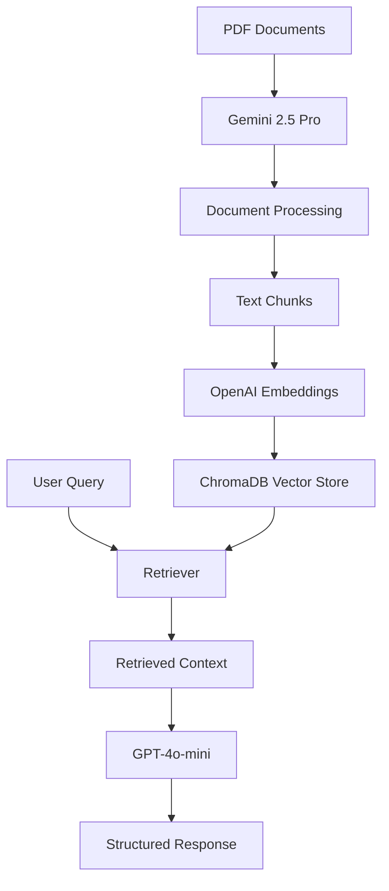

# RAG-Based Query Handling Assessment

## 🎯 Assessment Overview

This project implements a sophisticated RAG-based system that provides intelligent healthcare insurance advice for FlexiCare, PrimeCare, and ZenCare plans. The solution combines document retrieval with AI-powered question answering to deliver accurate, contextual responses about insurance coverage.

## 🏗️ My Approach

### Architecture Design
I built a multi-layered RAG system that separates concerns between document processing, vector storage, and query handling:

1. **Document Processing Layer**: Uses Google Gemini 2.5 Pro for robust PDF content extraction
2. **Vector Storage Layer**: ChromaDB for efficient similarity-based document retrieval  
3. **Query Processing Layer**: OpenAI GPT-4o-mini for generating structured, domain-specific responses
4. **API Layer**: FastAPI for clean, RESTful endpoints

### Key Technical Decisions

**Multi-Model Strategy**: 
- **Gemini 2.5 Pro** for PDF processing (superior document understanding)
- **GPT-4o-mini** for response generation (cost-effective, fast inference)
- **OpenAI Embeddings** for semantic search (proven performance)

**RAG Implementation**:
- Used LangChain's RetrievalQA chain for seamless retrieval-generation pipeline
- Implemented similarity search with top-k=3 for balanced context vs. noise
- Custom prompt template ensuring healthcare domain expertise and structured outputs

**Data Processing Pipeline**:
```python
PDF → Base64 → Gemini Extraction → Document Chunks → Embeddings → ChromaDB
```

## 🚀 How to Run the Solution

### Prerequisites
- Python 3.8+
- OpenAI API Key
- Google Gemini API Key
- Jupyter Notebook

### Quick Start

1. **Clone the repository**
   ```bash
   git clone https://github.com/Eddy-Emmanuel/RAG-Based-Query-Handling.git
   cd healthcare-rag-assessment
   ```

2. **Install dependencies**
   ```bash
   pip install -r requirements.txt
   ```

3. **Configure API keys**
   Create a `.env` file in the root directory:
   ```env
   OPENAI_API_KEY=your-openai-key
   GEMINI_API_KEY=your-gemini-key
   ```

4. **Process documents (one-time setup)**
   ```bash
   # Place your PDF files in the pdfs/ directory
   # Run the data extraction and preprocessing notebook
   jupyter notebook experiment.ipynb
   ```
   Execute all cells in the notebook to:
   - Extract content from PDF documents using Gemini
   - Create document embeddings
   - Store vectors in ChromaDB
     
**Though this has already been done while i was populating the db.**

5. **Start the server**
   ```bash
   python main.py
   ```

6. **Test the system**
   ```bash
   curl -X POST "http://localhost:8000/ai/rag/" \
        -H "Content-Type: application/json" \
        -d '{"user_query": "What are the zencare monthly benefits"}'
   ```

### API Documentation
Access interactive docs at: `http://localhost:8000/docs`

## 📊 System Architecture


## 🔧 System Components

### Core Files
- `main.py` - FastAPI application and server setup
- `endpoint_router/rag_endpoint.py` - API route handlers
- `utils/rag_utils.py` - RAG chain and document processing utilities
- `experiment.ipynb` - Data extraction, preprocessing, and vector storage notebook
- `.env` - Environment configuration (API keys)
- `env_config/config.py` - Configuration loader

### RAG Chain Configuration
```python
# Retriever settings
search_type="similarity"
search_kwargs={"k": 3}

# LLM settings  
model="gpt-4o-mini"
temperature=0  # Deterministic responses for consistency
```

### Custom Prompt Template
Specialized prompt ensuring:
- Healthcare domain expertise
- Plan-specific accuracy
- Structured markdown responses
- Clear limitation statements
- Actionable guidance

## 📊 Example Usage

**Input Query:**
```json
{
  "question": "What are the key differences between FlexiCare and PrimeCare deductibles?"
}
```

**System Response:**
```markdown
## FlexiCare vs PrimeCare Deductible Comparison

### FlexiCare
- Individual deductible: $1,500
- Family deductible: $3,000
- Out-of-network: $2,500 individual

### PrimeCare  
- Individual deductible: $500
- Family deductible: $1,000
- Out-of-network: $1,500 individual

### Key Takeaway
PrimeCare offers significantly lower deductibles, making it more cost-effective for frequent healthcare users.
```
---
