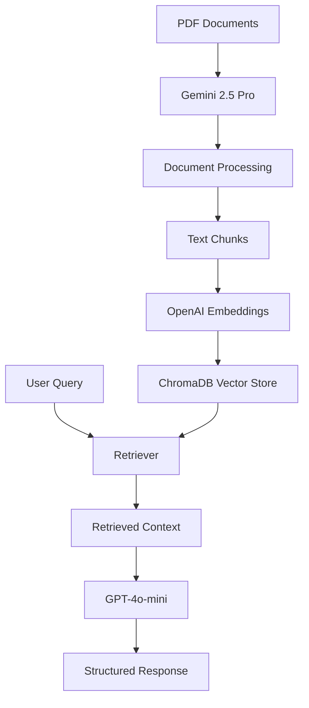

# Healthcare Insurance RAG Advisor

A sophisticated Retrieval-Augmented Generation (RAG) system that provides intelligent healthcare insurance advice for FlexiCare, PrimeCare, and ZenCare plans using LangChain, ChromaDB, and multiple AI models.

## 🏥 Overview

This system combines document retrieval with AI-powered question answering to help users make informed decisions about healthcare insurance coverage. It processes PDF documents containing insurance plan details and provides accurate, contextual responses to user queries.

## ✨ Features

- **Multi-Model AI Integration**: Utilizes OpenAI GPT-4o-mini and Google Gemini 2.5 Pro
- **PDF Document Processing**: Automated extraction and processing of insurance plan documents
- **Vector Database**: ChromaDB for efficient document storage and retrieval
- **FastAPI Web Interface**: RESTful API endpoints for easy integration
- **Intelligent Retrieval**: Similarity-based search with configurable parameters
- **Structured Responses**: Markdown-formatted answers with plan comparisons
- **Source Attribution**: Tracks document sources for transparency

## 🛠️ Technology Stack

- **Backend Framework**: FastAPI
- **AI Models**: 
  - OpenAI GPT-4o-mini (Chat completion)
  - Google Gemini 2.5 Pro (Document processing)
  - OpenAI text-embedding-3-small (Embeddings)
- **Vector Database**: ChromaDB
- **Document Processing**: LangChain
- **Language**: Python 3.8+

## 📋 Prerequisites

- Python 3.8 or higher
- OpenAI API key
- Google Gemini API key
- Git

## 🚀 Installation

1. **Clone the repository**
   ```bash
   git clone https://github.com/yourusername/healthcare-rag-advisor.git
   cd healthcare-rag-advisor
   ```

2. **Create virtual environment**
   ```bash
   python -m venv venv
   source venv/bin/activate  # On Windows: venv\Scripts\activate
   ```

3. **Install dependencies**
   ```bash
   pip install -r requirements.txt
   ```

4. **Set up environment configuration**
   
   Create a configuration file in `env_config/config.py`:
   ```python
   class EnvConfig:
       OPENAI_API_KEY = "your-openai-api-key"
       GEMINI_API_KEY = "your-gemini-api-key"
   ```

5. **Prepare your documents**
   - Place your healthcare plan PDF documents in the `pdfs/` directory
   - Run the document processing script to populate the vector database

## 📁 Project Structure

```
healthcare-rag-advisor/
├── main.py                 # FastAPI application entry point
├── endpoint_router/        # API route definitions
├── env_config/            # Environment configuration
├── chroma_langchain_db/   # ChromaDB vector store
├── pdfs/                  # PDF documents directory
├── utils/                 # Utility functions
├── model/                 # Data models and schemas
├── requirements.txt       # Python dependencies
└── README.md             # Project documentation
```

## 🔧 Configuration

### API Keys Setup
1. Obtain API keys from:
   - [OpenAI Platform](https://platform.openai.com/api-keys)
   - [Google AI Studio](https://makersuite.google.com/app/apikey)

2. Update `env_config/config.py` with your keys

### Vector Store Configuration
The system uses ChromaDB with the following default settings:
- Collection name: `rag_knowledge_base`
- Search type: Similarity
- Retrieved documents: 3 (configurable via `k` parameter)
- Persistence directory: `./chroma_langchain_db`

## 🚀 Usage

### Starting the Server
```bash
uvicorn main:app --host 127.0.0.1 --port 8000 --reload
```

The API will be available at `http://localhost:8000`

### API Documentation
Access the interactive API documentation at:
- Swagger UI: `http://localhost:8000/docs`
- ReDoc: `http://localhost:8000/redoc`

### Example API Request
```bash
curl -X POST "http://localhost:8000/ask" \
     -H "Content-Type: application/json" \
     -d '{"question": "What are the coverage differences between FlexiCare and PrimeCare?"}'
```

### Document Processing
To add new insurance plan documents:
```python
# Add PDF paths to the list
pdf_paths = ["path/to/flexicare.pdf", "path/to/primecare.pdf"]

# Process documents
documents = CreateDocuments(pdf_paths)

# Add to vector store
vector_store.add_documents(documents)
```

## 📊 System Architecture



## 🎯 Key Components

### RAG Chain
The system implements a RetrievalQA chain that:
1. Receives user questions
2. Retrieves relevant document chunks
3. Formats context with a specialized prompt
4. Generates structured responses

### Prompt Template
The system uses a specialized prompt that ensures:
- Healthcare insurance domain expertise
- Plan-specific information accuracy
- Structured, actionable responses
- Clear limitations and exclusions

## 🔍 Supported Insurance Plans

- **FlexiCare**: Flexible healthcare coverage options
- **PrimeCare**: Premium healthcare insurance plans  
- **ZenCare**: Wellness-focused insurance solutions

## 🛡️ Response Guidelines

The system follows strict guidelines:
- Uses only official document information
- Clearly states information limitations
- Provides structured plan comparisons
- Includes exclusions and requirements
- Offers actionable next steps
- Maintains markdown formatting

## 🤝 Contributing

1. Fork the repository
2. Create a feature branch (`git checkout -b feature/amazing-feature`)
3. Commit your changes (`git commit -m 'Add amazing feature'`)
4. Push to the branch (`git push origin feature/amazing-feature`)
5. Open a Pull Request

## 📝 License

This project is licensed under the MIT License - see the [LICENSE](LICENSE) file for details.

## ⚠️ Disclaimer

This system provides general information about healthcare insurance plans and should not be considered as professional medical or financial advice. Always consult with qualified healthcare and insurance professionals for specific coverage decisions.

## 🆘 Support

For support and questions:
- Open an issue on GitHub
- Check the [documentation](docs/)
- Review the API documentation at `/docs`

## 🔮 Future Enhancements

- [ ] Multi-language support
- [ ] Real-time document updates
- [ ] Advanced query understanding
- [ ] Integration with insurance APIs
- [ ] Mobile application support
- [ ] Voice query capabilities

---

**Made with ❤️ for better healthcare decisions**
